# Architecture

## Diagram

```mermaid
flowchart LR
    Cron[GitHub Actions cron 6h]
    Trigger[POST /trigger on Modal]
    Main[main.run_pipeline]
    Cron --> Main
    Trigger --> Main

    subgraph Sources
        OS[OpenStates v3<br/>recent bills]
        LDA[LDA<br/>LD-1 registrations]
        EDGAR[SEC EDGAR<br/>10-K + 8-K via edgartools]
        ALEC[Static model bills<br/>config/model_bills.yml]
    end

    subgraph Enrich
        EMB[TF-IDF cosine<br/>scikit-learn]
        EXT10K[Claude tool-use<br/>10-K topic extraction]
        EXT8K[Claude tool-use<br/>8-K state-reg extraction]
        ICP[ICP / topic lookups]
    end

    subgraph Detect
        SA[Signal A:<br/>multistate bill cluster<br/>+ LDA + 10-K topic]
        SC[Signal C:<br/>8-K state-reg<br/>+ active bills]
        SD[Signal D3:<br/>bill matches model<br/>w/ propagation history]
    end

    Main --> Sources
    Sources --> Enrich
    Enrich --> Detect
    Detect --> Score[Score<br/>0-100 + component breakdown]
    Score --> Route{score?}
    Route -- ">=70" --> Slack[Slack alert<br/>or stdout dry-run]
    Route -- "50-69" --> Watch[data/watchlist.jsonl]
    Route -- "<50" --> Drop[drop]
```

## Design rationale

**Fixtures-first development mode.** Every source (HTTP and LLM) routes through
`tests/fixtures/<source>/<scenario>.json` when `USE_LIVE_APIS=false`. This
shipped the demo with zero API key requirements for reviewers and cut iteration
cost to ~$1 across the build (vs $20-50 for live-per-iteration). Live mode runs
the same code path but hits real APIs. The contract: `python -m signals.main`
must complete end-to-end without any external dependencies.

**Three signals, not five.** The spec's rubric weighs signal *value* highest
(35%). Three load-bearing signals beat five thin ones. Each signal is
multi-source by design: every detector requires evidence from at least two
distinct sources before emitting.

**Precision over recall in scoring.** Alert threshold is 70 of 100; the watchlist
band (50-69) catches medium-confidence signals without spamming Slack. Rep trust
is the binding constraint in signal-based selling — one bad alert costs more
than one missed good signal.

**Transparent score breakdown.** Every alert ships with its component
contributions (e.g., `cluster_size=30, lda_recency=19.7, icp_company_count=10,
cluster_cohesion=17.5`). Reps can see *why* an alert scored what it did and
build calibration intuition.

**No database in v1.** State is JSON on disk (`data/last_run.json` for FastAPI
`/health`, `data/watchlist.jsonl` for the medium-confidence band). SQLite the
moment we need cross-run dedup or rep feedback.

**TF-IDF over dense embeddings (deliberate trade-off).** Spec called for Claude
embeddings, but Anthropic's recommended embedding path is Voyage AI (separate
API key). To preserve the fixtures-first contract (no extra keys), v1 uses
scikit-learn TF-IDF. Similarity thresholds rebalanced from spec's 0.80-0.85
(dense-embedding world) to 0.20-0.25 (TF-IDF world). Trade-off: TF-IDF misses
paraphrased same-meaning legislation but works well for near-verbatim
coordinated bills and model-bill matching. See DECISION_MEMO for swap path.

**Claude tool-use, not text-mode JSON.** Both extraction tasks use Anthropic
tool-use to force structured output. Initial implementation used `text` mode
and parsed JSON — broke on the first 8-K where Claude failed to escape
embedded quotes in `supporting_text`. Tool-use guarantees a validated payload;
the bad case is now a malformed `topics` array which gets caught defensively
in main.py and the offending company is skipped without taking down the run.

**Modal over Vercel for live URL.** Vercel imposes a 60s function execution
limit; live pipeline runs take 3-5 minutes. Modal has native Python serverless
and supports the `@modal.asgi_app` decorator over our FastAPI app cleanly.

## Source-by-source notes

See [`source-research/`](source-research/) for the per-source spike.

Notable empirical findings during build:

- **OpenStates** free-tier 429s aggressively under bursts. Capture script
  uses 8-second spacing + 0.2 RPS rate limit. Conservative for live mode.
- **LDA's `/filings/` endpoint has no structured `general_issue_code` filter**
  (verified against OpenAPI YAML at `/api/openapi/v1/`). Issue-code filtering
  happens client-side after fetch. The `lda.senate.gov` host sunsets
  **2026-06-30** — every response carries a `Sunset:` header pointing to the
  successor at `lda.gov/api/v1/`. We honor this via `LDA_BASE_URL` env var.
- **SEC EDGAR** requires a declared User-Agent (Akamai 403s without). The
  `edgartools` library handles Item 1A extraction's nightmare cases — TOC
  false-positives (29 `"Item 1A"` matches in Pfizer's 10-K, only one is the
  header), missing Item 1B, iXBRL wrappers around the text.
- **8-K body text rarely mentions state regulations.** Empirical: scanned 195
  most-recent 8-Ks across the 13 ICP companies for state regulatory keywords,
  zero hits. State regulatory discussion lives in 10-Q MD&A and 8-K Exhibit 99
  press releases. Signal C ships with one synthetic 8-K fixture
  (`is_synthetic_demo: true` in the JSON) so the detector can be demoed. v2
  Signal C should read 8-K Exhibit 99 text where the content actually lives.
