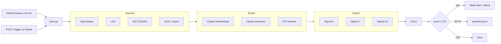

# Architecture

Stub — filled in during build task 12.

## Diagram

## Design rationale

- Fixtures-first dev mode keeps iteration fast and cheap. Live mode only proves the wiring.
- Three signals chosen for non-obviousness and load-bearing enrichment, not breadth.
- Precision > recall by design — rep trust is the binding constraint.
- No DB in v1; JSON on disk + in-memory state are sufficient.

## Source-by-source notes

See `source-research/`.
